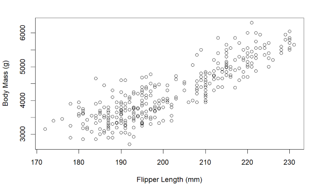
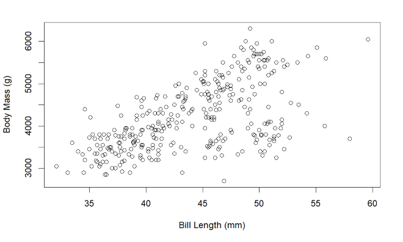
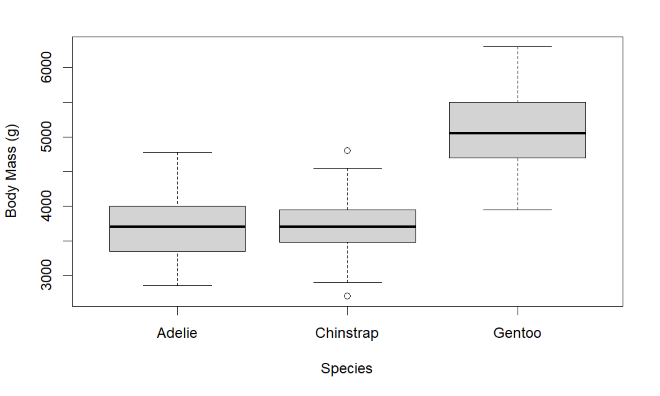
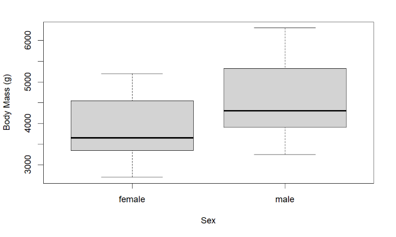
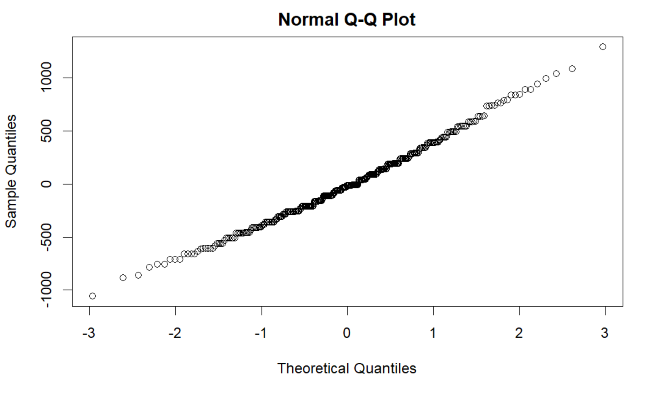

# Interpreting data from the package 'palmerpenguins' with R
Columns containing the species, sex, body mass, flipper length and bill length were used, and rows with missing values in any of these columns were removed.

## A. Visualizing the relationship between body mass and :

### i. Flipper Length

### ii. Bill length

### iii. Species

### iv. Sex

## B. Using OLS Simple Linear Regression to identify the relationship between Body mass and Flipper length and checking if the model holds.

The linear model obtained is : **body mass = −5872.0929 + 50.1533 × (flipper length)**
and $R^2$ is 0.7621

> $R^2$ is high (max value is 1), which indicates that flipper length is highly predictive of body mass. In fact, flipper length predicts 76% of the variance of body mass. Also, this $R^2$ value corresponds to a correlation coefficient of r = $\sqrt{R^2}$ = 0.8729789, which is a strong correlation.

> The fact that this is a relatively straight line suggests that our residuals are normally distributed, which supports our choice of a linear model.
> In summary, yes this is a good model.

## C. Using OLS Multiple Linear Regression to find which variables have the strongest effect on body mass?

The **standardized** model is : **body mass = −0.531 − (0.362 × Chinstrap) + (0.878 × Gentoo) + (0.578 × male) + (0.311 × flipper) + (0.147 × bill)**

> If we don’t know the sex of a penguin, then we could give a value of 0.5 (1 of 2 genders) to the dummy variables sexmale. So observing the sex of a penguin changes our estimate of this variable by ±0.5, which then changes our estimate of standardized body mass by (±0.5) × 0.58 = ±0.29.
>
> If we apply the same analysis to the species variable, assuming that the species are equally probable to start with, then if we don’t know the species, we would assign the value 0.33 (1 of 3 species) to both speciesChinstrap and speciesGentoo. Then observing the species of a penguin has the following effects on our estimate of standardized body mass:
> - If we find it’s a Chinstrap, that changes the speciesChinstrap variable from 0.33 to 1, i.e. increases it by 2/3 = .67, and also decreases the speciesGentoo variable from 0.33 to 0, i.e. decreases it by 0.33, so the overall change change in our estimate of standardized body mass is 0.67∗(−0.36)+(−0.33)∗0.89 = −0.53.
> - If we find it’s a Gentoo, this changes the speciesChinstrap variable from 0.33 to 0 and the speciesGentoo variable from 0.33 to 1, so the overall change in our estimate of standardized body mass (−0.33) ∗ (−0.36) + (0.67) ∗ 0.89 = 0.72.
> - If we find it’s an Adelie, our estimate doesn’t change. 
> So the mean absolute value of the change in our estimate is (0.53 + 0.72 + 0)/3 = 0.42. 
>
> In conclusion, our predictors with highest effects are: **Species (0.42), Flipper Length (0.31) and Sex (0.29).** So these are the ones I would most want to know if estimating body mass using this model.

